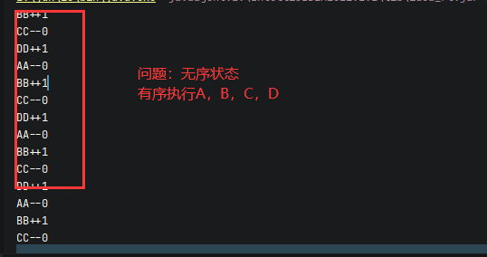

## 多线程

- 程序是指令和数据的有序集合，其本身没有任何运行的含义，是一个静态的概念。
- 进程是执行程序的的一次执行过程，是**系统资源分配的单位**。
- 一个进程可以包含多个线程。线程是**CPU调度和执行的单位**。


核心概念

- 线程就是独立的执行路径；
- 在程序运行时，即使没有自己创建线程，后台也会有很多个线程，如主线程，gc线程；
- main()称之为主线程，为系统的入口，用于执行整个程序；
- 在一个进程中，如果开辟了多个线程，线程的运行由调度器安排调度，调度器是与操作系统密切相关的，先后顺序是不能人为干预的；
- 对同一份资源操作时，会存在资源抢夺的问题，需要加入并发控制；
- 线程会带来额外的开销，如cpu调度时间，并发控制开销；
- 每个线程在自己的工作内存交互，内存控制不当会造成数据不统一。

### 1、线程创建

#### 1. 继承Thread类

- 自定义线程类继承Thread类
- 重写run()方法，编写线程执行体
- 创建线程对象，调用start()方法启动线程

```java
//总结： 注意，线程开启不一定立即执行，由cpu调度
public class TestThread01 extends Thread{
    @Override
    public void run() {
        super.run();
        //run方法线程体
        for (int i = 0; i < 200; i++) {
            System.out.println("my thread");
        }
    }

    public static void main(String[] args) {
        //main线程，主线程

        //创建一个线程对象
        TestThread01 testThread01 = new TestThread01();
        //调用start（）方法开启线程
        testThread01.start();
        for (int i = 0; i < 200; i++) {
            System.out.println("main Thread");
        }
    }
}
```

```java

//练习Thread，实习多线程同步下载图片
public class TestThread02 extends Thread{
    private String url;//网络图片地址
    private String pathName;//保存的文件名

    public TestThread02 (String url,String pathName) {
        this.pathName = pathName;
        this.url = url;
    }

    //下载图片线程的执行体
    @Override
    public void run() {
        new WebDownLoader().webLoader(url,pathName);
    }

    public static void main(String[] args) {
        TestThread02 testThread01 = new TestThread02("https://gimg2.baidu.com/image_search/src/1.jpg","1.jpg");
        TestThread02 testThread02 = new TestThread02("https://gimg2.baidu.com/image_search/src/2.jpg","2.jpg");
        TestThread02 testThread03 = new TestThread02("https://gimg2.baidu.com/image_search/src/3.jpg","3.jpg");
        testThread01.start();
        testThread02.start();
        testThread03.start();
    }
}
//web下载器
class WebDownLoader {
    public void webLoader (String url, String pathName) {
        try {
            FileUtils.copyURLToFile(new URL(url),new File(pathName));
        } catch (IOException e) {
            System.out.println("IO异常，下载方法出问题");
        }
    }
}
```


#### 2. 实现Runable接口

- 创建线程方式∶实现runnable接口,重写run方法
- 执行线程需要丢入runnable接口实现类,调用start方法

```java
//创建线程方式∶实现runnable接口,重写run方法，执行线程需要丢入runnable接口实现类,调用川start方法、
public class TestThread04 implements Runnable{
    @Override
    public void run() {
        for (int i = 0; i < 200; i++) {
            System.out.println("new Thread" + i);
        }

    }

    public static void main(String[] args) {
        TestThread04 testThread04 = new TestThread04();

        new Thread(testThread04).start();

        for (int i = 0; i < 200; i++) {
            System.out.println("main thread" + i);
        }
    }
}
```

- 继承Thread类

  - 子类继承Thread类具备多线程能力
  - 不建议使用：避免OOP单继承局限性；

- 实现Runnable接口

  - 实现接口Runable具有多线程能力

  - 推荐使用：避免单继承局限性，灵活方便，方便同时一个对象被多个线程使用；

    ```java
     public static void main(String[] args) {
         //同时一个对象被多个线程使用
            TestThread03 test = new TestThread03("https://gimg2.baidu.com/image_search/","1.jpg");
            new Thread(test).start();
            new Thread(test).start();
            new Thread(test).start();
            new Thread(test).start();
        }
    ```

    ```java
    //兔龟赛跑
    public class TestThread06 implements Runnable{
        private static String winner;
        @Override
        public void run() {
            for (int i = 0; i <= 100; i++) {
    
                if (Thread.currentThread().getName().equals("兔子") && i % 18 == 0) {
                    try {
                        Thread.sleep(10);
                    } catch (InterruptedException e) {
                        e.printStackTrace();
                    }
                }
                if (gameover(i)) {
                    break;
                }
    
                System.out.println(Thread.currentThread().getName() + "跑了" + i + "步" );
    
            }
        }
    
        private boolean gameover (int steps) {
            if (winner != null) {
                return true;
            } else {
                if (steps >= 100) {
                    winner = Thread.currentThread().getName();
                    System.out.println(winner + "赢了！");
                    return true;
                }
            }
    
            return false;
    
        }
    
        public static void main(String[] args) {
            TestThread06 testThread06 = new TestThread06();
            new Thread(testThread06,"兔子").start();
            new Thread(testThread06,"乌龟").start();
    
        }
    }
    ```

    

#### 3. 实现Callable接口

##### 	3.1 实现Callable接口，需要返回值类型

##### 	3.2 重写call方法，需要抛出异常

##### 	3.3 创建目标对象

##### 	3.4 创建执行服务:ExecutorService ser = Executors.newFixedThreadPool(1);

##### 	3.5 提交执行:Future<Boolean> result1 = ser.submit(t1);

##### 	3.6 获取结果:boolean r1 = result1.get()

##### 	3.7 关闭服务: ser.shutdownNow();

```java
package com.lbgao.thread.demo02;

import com.lbgao.thread.demo01.TestThread02;
import org.apache.commons.io.FileUtils;

import java.io.File;
import java.io.IOException;
import java.net.URL;
import java.util.concurrent.*;

/**
 * @Auther: lbgao
 * @Date: 2022/3/3 23:08
 */

public class TestCallable implements Callable<Boolean> {
    private String url;
    private String pathName;

    public TestCallable (String url,String pathName) {
        this.pathName = pathName;
        this.url = url;
    }

    @Override
    public Boolean call() {
        new WebDownLoader1().webLoader(url,pathName);
        System.out.println("下载好了" + pathName);
        return true;
    }

    public static void main(String[] args) throws ExecutionException, InterruptedException {
        TestCallable t1 = new TestCallable("https://gimg2.baidu.com/image_search/src/1.jpg","1.jpg");
        TestCallable t2 = new TestCallable("https://gimg2.baidu.com/image_search/src/2.jpg","2.jpg");
        TestCallable t3 = new TestCallable("https://gimg2.baidu.com/image_search/src/3.jpg","3.jpg");

        //创建执行服务
        ExecutorService ser = Executors.newFixedThreadPool(3);

        //提交执行
        Future<Boolean> r1 = ser.submit(t1);
        Future<Boolean> r2 = ser.submit(t2);
        Future<Boolean> r3 = ser.submit(t3);

        //执行结果
        boolean res1 = r1.get();
        boolean res2 = r2.get();
        boolean res3 = r3.get();

        //关闭服务
        ser.shutdown();
    }
}

//web下载器
class WebDownLoader1 {
    public void webLoader (String url, String pathName) {
        try {
            FileUtils.copyURLToFile(new URL(url),new File(pathName));
        } catch (IOException e) {
            System.out.println("IO异常，下载方法出问题");
        }
    }
}
```


### 2、Lambda表达式

functional Interface(函数式接口)是学习java 8lambda表达式关键所在。

##### 函数式接口的定义：

- 任何接口，如果只包含唯一一个抽象方法，那么它就是一个函数式接口。

```java
public interface Runnable {
    public abstract void run();
}
```

- 对于函数式接口，我们可以通过lambda表达式来创建该对象的接口。
- 为什么要使用lambda表达式？
  - 避免匿名内部类定义过多；
  - 可以让你的代码简洁；

```java
public class TestLambda01 {
    public static void main(String[] args) {
        ILike like = new Like();
        like.lambda();

        like = new Like2();
        like.lambda();


        //4 局部内部类
        class Like3 implements ILike {
            @Override
            public void lambda() {
                System.out.println("i like lambda4");
            }
        }

        like = new Like3();
        like.lambda();

        //5. 匿名内部类，没有类的名称，必须借助接口或者父类
        like = new ILike() {

            @Override
            public void lambda() {
                System.out.println("i like lambda5");
            }
        };
        like.lambda();

        //6. 用lambda简化
        like = () -> {
            System.out.println("i like lambda6");
        };
        like.lambda();
    }

    //3.  静态内部类
    static class Like2 implements ILike {
        @Override
        public void lambda() {
            System.out.println("i like lambda2");
        }
    }


}

//1. 定义一个函数式接口
interface ILike {
    void lambda();
}

//2. 实现类
class Like implements ILike {
    @Override
    public void lambda() {
        System.out.println("i like lambda1");
    }
}
```


```java
public class TestLambda02 {
    public static void main(String[] args) {
        ILove love = (int a) -> {
            System.out.println("i love " + a);
        };

        love.love(0);

        //简化1 ： 参数类型
        love = (a) -> {
            System.out.println("i love " + a);
        };
        love.love(1);

        //简化2 ：简化括号
        love = a -> {
            System.out.println("i lvoe" + a);
        };
        love.love(2);

        //简化3 ： 去掉花括号
        love = a -> System.out.println("i love " + a);
        love.love(3);

        //总结：
        /**
         *  1. lambda 表达式只能有一行代码的情况才能简化成一行，如果有多行，那么就用代码块包裹
         *  2. 前提是接口为函数式接口
         *  3. 多个参数也可以去掉参数类型，要去掉就都去掉
         */
    }
}

interface ILove {
    void love (int a);
}
```

### 3、线程状态


#### 3.1 停止线程

- 不推荐使用JDK提供的stop（），destroy（）方法
- 推荐线程自己停止下来
- 建议使用一个标志位进行终止变量，当flag = false，则终止线程运行 

 ```java
 
 //1. 建议线程正常停止 ---> 利用次数，不建议死循环
 //2. 建议使用标志位 ---> 设置一个标志位
 //3. 不要使用stop或者destroy等过时方法
 public class TestStop implements Runnable{
     //1. 设置一个标志位
     static boolean flag;
 
     @Override
     public void run() {
         while (!flag)
         System.out.println("running thread");
     }
 
     //2. 设置一个公开的方法停止线程，转换标志位
     public void stop () {
         flag = true;
     }
 
     public static void main(String[] args) {
         TestStop testStop = new TestStop();
 
         new Thread(testStop).start();
 
         for (int i = 0; i < 1000; i++) {
             System.out.println("main" + i);
             if (i == 900) {
                 //调用stop方法切换标志位，让线程停止
                 testStop.stop();
                 System.out.println("is stop");
             }
         }
     }
 }
 ```

#### 3.2  线程休眠

- sleep(时间)指定当前线程阻塞的毫秒数；
- sleep存在异常InterruptedException；
- sleep时间达到后线程进入就绪状态；
- sleep可以模拟网络延迟，倒计时等；
- **每个对象都有一个锁，sleep不会释放锁；**

**模拟网络延时：放大问题的发生性**

```java
//模拟倒数计时
public class TestSleep {
    public static void main(String[] args) {
        Date time = new Date(System.currentTimeMillis());
        while (true) {
            try {
                Thread.sleep(1000);
                System.out.println(new SimpleDateFormat("HH:mm:ss").format(time));
                time = new Date(System.currentTimeMillis());
            } catch (InterruptedException e) {
                e.printStackTrace();
           }
        }

    }
}
```

#### 3.3 线程礼让

- 礼让线程，**让当前正在执行的线程暂停，但不阻塞**；
- 将线程从运行状态转为就绪状态
- **让cpu重新调度，礼让不一定成功，看cpu心情**

```java
//测试礼让线程
//礼让不一定成功，看cpu心情
public class TestYield {
    public static void main(String[] args) {
        new Thread(new MyYield(),"a").start();
        new Thread(new MyYield(),"b").start();
    }
}


class MyYield implements Runnable {
    @Override
    public void run() {
        System.out.println(Thread.currentThread().getName() + "线程开始");
        Thread.yield();//礼让
        System.out.println(Thread.currentThread().getName() + "线程停止执行");
    }
}
```

#### 3.4 Join

- Join合并线程，待此线程执行完成后，再执行其他线程，**其他线程阻塞**；
- 可以想象成插队；

```java
public class TestJoin implements Runnable{
    @Override
    public void run() {
        for (int i = 0; i < 1000; i++) {
            System.out.println("vip" + i);
        }
    }
    public static void main(String[] args) throws InterruptedException {
        Thread thread = new Thread(new TestJoin());
        thread.start();

        for (int i = 0; i < 500; i++) {
            if (i == 300) {
                thread.join();
            }
            System.out.println("main" + i);
        }
    }
}
```

#### 3.5 线程状态观测

- Thread.state
  - 线程状态。线程可以处于以下状态之一
    - new  	       尚未启动的线程处于状态；
    - runnable    在java虚拟机中执行的线程处于此状态；
    - blocked      被阻塞等待监视器锁定的线程处于此状态；
    - wating        正在等待另一个线程执行特定动作的线程处于此状态；
    - timed_wating     正在等待另一个线程执行动作达到指定等待时间的线程处于此状态；
    - terminated         已经退出的线程处于此状态；  

```java
//观察测试线程的状态
public class TestState {
    public static void main(String[] args) throws InterruptedException {
        Thread thread = new Thread( () -> {
           for (int i = 0 ; i < 3 ; i++) {
               try {
                   Thread.sleep(1000);
               } catch (InterruptedException e) {
                   e.printStackTrace();
               }
           }
            System.out.println("*******");
        },"test");

        //观察状态
        Thread.State state = thread.getState();
        System.out.println(state);//new

        thread.start();//启动线程
        state = thread.getState();
        System.out.println(state);//run

        while (state != Thread.State.TERMINATED) {//只要线程不停止，一直输出状态
           Thread.sleep(100);
            System.out.println(state);
            state = thread.getState();//timed_wating
        }
        state = thread.getState();
        System.out.println(state);//terminated
        thread.start();//报错 ： 死亡后的线程是不能再次启动的。
    }
}
```

#### 3.6 线程优先级

- java提供一个**线程调度器**来监控程序中启动后进入**就绪状态**的所有线程，线程调度器按照优先级觉得调度哪个线程来执行。
- 线程优先级高不一定先执行，但权重大了，资源就给的多了，提高了被调度的几率。
- 线程的优先级用数字表示，范围从1~10
  - Thread.MIN_PRIORITY = 1;
  - Thread.MAX_PRIORITY = 10;
  - Thread.NORM_PRIORITY = 5;
- 使用以下方式改变或获取优先级
  - getPriority();
  - setPriority(int  xx);

#### 注：优先级低只是意味着获得调度的概率低，并不是优先级低就不会被调用，这都是看CPU的调度的。

```java

//测试线程的优先级
public class TestPriority {
    public static void main(String[] args) {
        //主线程默认优先级
        System.out.println(Thread.currentThread().getName() + "--->" +
                Thread.currentThread().getPriority());


        MyPriority myPriority = new MyPriority();

        Thread t1 = new Thread(myPriority);
        Thread t2 = new Thread(myPriority);
        Thread t3 = new Thread(myPriority);
        Thread t4 = new Thread(myPriority);

        //先设置优先级，再启动
        t1.start();

        t2.setPriority(1);
        t2.start();

        t3.setPriority(Thread.MAX_PRIORITY);//10
        t3.start();

        t4.setPriority(11);//报错
        t4.start();
    }
}

class MyPriority implements Runnable {
    @Override
    public void run() {
        System.out.println(Thread.currentThread().getName() + "-->" +
        Thread.currentThread().getPriority());
    }
}
```

#### 3.7 守护线程(daemon)线程

- 线程分为用户线程和守护线程;
- 虚拟机必须确保用户线程执行完毕（main）;
- 虚拟机不用等待守护线程执行完毕（后台记录操作日志，监控内存，gcc等）

 ```java
 public class TestDaemon {
     public static void main(String[] args) {
         God god = new God();
         You you = new You();
 
         Thread thread = new Thread(god);
         thread.setDaemon(true);//默认是false 是用户线程
         thread.start();
 
         new Thread(you).start();
     }
 }
 
 class You implements Runnable {
 
     @Override
     public void run() {
         for (int i = 0; i < 36500; i++) {
             System.out.println("live for " + i + " years");
         }
         System.out.println("leave world!");
     }
 }
 
 class God implements Runnable {
 
     @Override
     public void run() {
         while (true) {
             System.out.println("god bless you!");
         }
     }
 }
 ```

### 4、线程同步

多个线程操作同一个资源

- **并发：同一个对象被多个线程同时操作**。

**处理多线程问题时，多个线程访问同一个对象，并且某些线程还想修改这个对象，这时候我们**

**就需要线程同步，线程同步其实就是一种等待机制，多个需要同时访问此对象的线程进入这**

**个对象的等待池形成队列，等待前面线程使用完毕，下一个线程再使用。**


- **队列和锁**

每一个对象都有一个锁。

由于同一进程的多个线程共享同一块存储空间，在带来方便的同时，也带来了访问冲突问题，

为了保证数据在方法中被访问时的准确性，在访问时加入了**锁机制 synchronized**，当一个线

程获得对象的**排他锁**，独占资源，其他线程必须等待，使用后释放锁即可，存在以下问题：

- 一个线程持有锁会导致其他所有需要此锁的线程挂起；
- 在多线程竞争下，加锁，释放锁会导致比较多的**上下文切换和调度延时**，引起性能问题；
- **如果以个优先级高的线程等待一个优先级低的线程释放锁，会导致优先级倒置，引起性能问题。**


#### 4.1 同步方法

- **synchronized方法：控制对对象的访问**，**每个对象对应一把锁，每个synchronized方法都必须获得该方法的对象的锁才能执行，否则线程会阻塞，**方法一旦执行就独占该锁，直到该方法返回才释放锁，后面被阻塞的线程才能获得这个锁，继续执行。

  **缺陷：若将一个大的方法申明为synchronized将会影响效率；**

  ```java
    private synchronized void buy() throws InterruptedException {
          if (ticketNums <= 0) {
              flag = false;
              return;
          }
          else {
  
              System.out.println(Thread.currentThread().getName() + " " + ticketNums);
              ticketNums--;
          }
      }
  ```
  
  

#### 4.2 同步块

- 同步块：synchronized(Obj) {}
- Obj称之为 **同步监视器**
  - Obj可以是任何对象，但是推荐使用贡献资源作为同步监视器
  - 同步方法中无需指定同步监视器，因为同步方法的同步监视器就是this，就是这个对象本身，或者是class
- 同步监视器的执行过程：
  - 第一个线程访问，锁定同步监视器，执行其中代码；
  - 第二个线程访问，发现同步监视器被锁定，无法访问；
  - 第一个线程访问完毕，解锁同步监视器；
  - 第二个线程访问，发现同步监视器没有锁，然后锁定并访问。

```java
public class UnsafeList {
    public static void main(String[] args) throws InterruptedException {
        ArrayList<Integer> list = new ArrayList<>();

        for (int i = 0; i < 100000; i++) {
            new Thread(() -> {
                synchronized (list) {
                    list.add(1);
                }
            }).start();
        }
       // Thread.sleep(1000);
        System.out.println(list.size());
        System.out.println(list.size());
        System.out.println(list.size());
        System.out.println(list.size());
        System.out.println(list.size());
        System.out.println(list.size());
        System.out.println(list.size());
        System.out.println(list.size());
    }
}
```

#### 4.3 CopyOnWriteArrayList

```java
public class TestJUC {
    public static void main(String[] args) throws InterruptedException {
        CopyOnWriteArrayList<Integer> list = new CopyOnWriteArrayList<>();

        for (int i = 0; i < 10000; i++) {
            new Thread(() -> {
                list.add(1);

            }).start();
        }

        Thread.sleep(100);
        System.out.println(list.size());


    }
}
```

#### 4.4 死锁

各个线程各自占有一些资源，并且互相等待其他线程占有的资源才能运行，而导致两个或者多个线程都在等待对方释放资源，都停止执行的情形，某个同步块同时拥有“两个以上对象的锁”时，就可能会发生“死锁”的问题。

```java

//死锁：多个线程互相抱着对方需要的资源，然后形成僵持
public class DeadLock {
    public static void main(String[] args) {
        Makeup g1 = new Makeup(0,"灰");
        Makeup g2 = new Makeup(1,"白");

        g1.start();
        g2.start();
    }
}

class Lipstick {}
class Mirror {}

class Makeup extends Thread {

    //需要的资源只有一份，用static来保证只有一份
    static Lipstick lipstick = new Lipstick();
    static Mirror mirror = new Mirror();

    int choice;
    String name;

    Makeup (int choice, String name) {
        this.choice = choice;
        this.name = name;
    }

    @Override
    public void run() {
        try {
            makeup();
        } catch (InterruptedException e) {
            e.printStackTrace();
        }
    }
    //化妆，互相持有对方的锁，就是需要拿到对方的资源
    private void makeup() throws InterruptedException {
        if (choice == 0) {
            synchronized (lipstick) {
                System.out.println(this.name + "获得口红的锁");
                Thread.sleep(1000);
                synchronized (mirror) {System.out.println(this.name + "获得镜子的锁");}
            }
        }else {
            synchronized (mirror) {
                System.out.println(this.name + "获得镜子的锁");
                Thread.sleep(1000);
                synchronized (lipstick) {System.out.println(this.name + "获得口红的锁");}
            }
        }
    }
}
```

#### 死锁的避免方法

- 产生死锁的四个必要条件
  1. 互斥条件：一个资源每次只能被一个进程使用；
  2. 请求与保持条件：一个进程因请求资源而阻塞的时候，对已获的资源保持不放；
  3. 不剥夺条件：进程已获得的资源，在未使用完之前，不能强行剥夺；
  4. 循环等待条件：若干进程之间形成一种头尾相接的循环等待资源关系。

#### 4.5 Lock（锁）

- 从JDK5.0 开始，java提供了更强大的线程同步机制——通过显示定义同步锁对象来实现同步。同步锁使用Lock对象充当。
- java.util.concurrent.locks.Lock接口是控制多个线程对共享资源进行访问的工具。锁提供了对共享资源的独占访问，每次只能有一个线程对Lock对象加锁，线程开始访问共享资源之前应先获得Lock对象；
- ReentrantLock类实现了Lock，它拥有了与synchronized相同的并发性和内存语义，在实现线程安全的控制中，比较常用的是ReentrantLock，可以显示加锁，释放锁。

##### synchronized 与 Lock的对比

- Lock是显示锁（手动开启和关闭锁，别忘记关闭锁）synchronized是隐式锁，出了作用域自动释放；
- Lock只有代码块锁，synchronized有代码块锁和方法锁；
- 使用Lock锁，JVM将花费比较少的时间来调度线程，性能更好。并且有更好的扩展性，提供了更多的子类；
- 优先使用顺序
  - Lock -> 同步代码块 -> 同步方法

```java

public class TestLock {
    public static void main(String[] args) {
        TestLock2 testThread02 = new TestLock2();

        new Thread(testThread02,"1").start();
        new Thread(testThread02,"2").start();
        new Thread(testThread02,"3").start();
    }
}

class TestLock2 implements Runnable {
    int tickNums = 100;

    //定义lock锁
    private final ReentrantLock lock = new ReentrantLock();

    @Override
    public void run() {
        while (true) {
            try {
                lock.lock();//加锁

                if (tickNums > 0) {
                        System.out.println(Thread.currentThread().getName() + " " + tickNums--);
                }else break;
            }finally {
                //解锁
                lock.unlock();
            }

        }
    }
}

```

### 5、线程协作

#### 5.1 线程通信

-  应用场景:生产者和消费者问题

  - 假设仓库中只能存放一件产品，生产者将生产出来的产品放入仓库,消费者将仓库中产品取走消费；
  - 如果仓库中没有产品，则生产者将产品放入仓库﹐否则停止生产并等待﹐直到仓库中的产品被消费者取走为止；
  - 如果仓库中放有产品﹐则消费者可以将产品取走消费﹐否则停止消费并等待，直到仓库中再次放入产品为止。

- 分析

  - **这是一个线程同步问题，生产者和消费者共享同一个资源，并且生产者和消费者之间互相依赖，互为条件；**
  - 对于生产者，没有生产产品之前，要控制消费者等待，而生产了产品之后，又需要马上通知消费者消费；
  - 对于消费者，在消费之后，要通知生产者已经结束了消费，需要生产新的产品；
  - 在生产者消费者问题中，仅有synchronized是不够。
    - synchronized可阻止并发更新同一个共享资源，实现了同步；
    - synchronized不能用来实现不同线程之间的消息传递。

- java提供了几个方法解决线程之间的通信问题

  > ​	wait()     表示线程一直等待，直到其他线程通知，与sleep不同，会释放锁

  > ​	wait(long timeout)      指定等待的毫秒数

  > ​	notify()    唤醒一个处于等待状态的线程

  > ​	notifyAll()   唤醒同一个对象上所有调用wait()方法的线程，优先级别高的线程优						先调度

**均是Object类的方法，都只能在同步方法或者同步代码块中使用。**

- **解决方法1**

  - 并发协作模型“生产者/消费者模式”--->管程法

    - 生产者:负责生产数据的模块(可能是方法，对象﹐线程﹐进程);
    - 消费者:负责处理数据的模块(可能是方法﹐对象，线程﹐进程)；
    - 缓冲区:消费者不能直接使用生产者的数据﹐他们之间有个缓冲区。

    **生产者将生产好的数据放入缓冲区，消费者从缓冲区拿出数据**


```java

public class TestPC {
    public static void main(String[] args) {
        SynContainer synContainer = new SynContainer();
        Productor productor = new Productor(synContainer);
        Consumer consumer = new Consumer(synContainer);

        productor.start();
        consumer.start();
    }
}

class Productor extends Thread{
    SynContainer container;

    public Productor (SynContainer synContainer) {
        this.container = synContainer;
    }

    @Override
    public void run() {
        for (int i = 0; i < 100; i++) {
            System.out.println("生产了" + i + "只");
            container.push(new Chicken(i));
        }
    }
}

class Consumer extends Thread{
    SynContainer container;

    public Consumer (SynContainer synContainer) {
        this.container = synContainer;
    }

    @Override
    public void run() {
        for (int i = 0; i < 100; i++) {
            Chicken chicken = container.pop();
            System.out.println("消费了" + chicken.id + "只");
        }
    }
}

class SynContainer {
    //容器大小
    Chicken[] chickens = new Chicken[10];

    int count = 0;

    //生产者加入产品
    public synchronized void push(Chicken chicken) {
        //如果容器满了，就需要等待消费者
        if (count == chickens.length) {
            try {
                this.wait();
            } catch (InterruptedException e) {
                e.printStackTrace();
            }
        }
        //如果没有满了，我们就需要丢入产品
        chickens[count++] = chicken;

        //可以通知消费者消费了
        this.notifyAll();
    }

    //消费者消费产品
    public synchronized Chicken pop() {
        //判断是否能消费
        if (count == 0) {
            //等待生产者生产
            try {
                this.wait();
            } catch (InterruptedException e) {
                e.printStackTrace();
            }
        }
        //如果可以消费
        count--;
        Chicken chicken = chickens[count];
        //通知生产者生产
        this.notifyAll();
        return chicken;
    }
}

class Chicken{
    int id;

    public Chicken(int id) {
        this.id = id;
    }
}
```

#### 5.2 使用线程池

- 背景：经常创建和销毁，使用量特别大的资源；
- 思路：提前创建好多个线程，放入线程池中，使用时之间获取，使用完放回池中。可以避免频繁创建销毁，实现重复利用。类似于生活中的公共交通工具；
- ExecutorService: 真正的线程池接口。常见子类ThreadPoolExecutor
  - void execute(Runnable command) ：执行任务/命令，没有返回值，一般用来执行Runable
  - <T> Future <T> submit(Callable<T> task)：执行任务，有返回值，一般用来执行Callable
  - void shutdown() ：关闭连接池
- Executors：工具类，线程的工厂类，用于创建并返回不同类型的线程池

```java

public class TestPool {
    public static void main(String[] args) {
        //1 创建服务，创建线程池
        //Executors.newFixedThreadPool(10) 参数为线程池大小
        ExecutorService ser = Executors.newFixedThreadPool(10);

        //执行
        ser.execute(new MyThread());
        ser.execute(new MyThread());
        ser.execute(new MyThread());
        ser.execute(new MyThread());
        ser.execute(new MyThread());

        //2 关闭连接
        ser.shutdown();
    }
}
class MyThread implements Runnable {
    @Override
    public void run() {
        System.out.println(Thread.currentThread().getName());
    }
}
```

## 多线程进阶

### 1、什么是JUC


java.util工具包、包、分类；

**业务：普通的线程代码  Thread**

**Runnable**  没有返回值   效率相比Callable相对较低！


### 2、线程和进程

> ​	线程、进程    

进程是资源分配的最小单位，线程是cpu调度的最小单位；

进程：一个程序，QQ.exe，Music.exe，程序的集合

一个进程往往可以包含多个线程，至少包含一个。

**Java默认有几个线程？2个  main、GC**

线程：开了一个进程 Typora，写字，自动保存（线程负责的）

对于java而言：Thread、Runnable、Callable

**java真的可以开启线程吗？**开不了

```java
 public synchronized void start() {
        /**
         * This method is not invoked for the main method thread or "system"
         * group threads created/set up by the VM. Any new functionality added
         * to this method in the future may have to also be added to the VM.
         *
         * A zero status value corresponds to state "NEW".
         */
        if (threadStatus != 0)
            throw new IllegalThreadStateException();

        /* Notify the group that this thread is about to be started
         * so that it can be added to the group's list of threads
         * and the group's unstarted count can be decremented. */
        group.add(this);

        boolean started = false;
        try {
            start0();//
            started = true;
        } finally {
            try {
                if (!started) {
                    group.threadStartFailed(this);
                }
            } catch (Throwable ignore) {
                /* do nothing. If start0 threw a Throwable then
                  it will be passed up the call stack */
            }
        }
    }
//本地方法，底层的C++，java无法直接操作硬件
    private native void start0();
```

> ​	并发、并行

并发编程：并发、并行

并发（多线程操作同一个资源）

- cpu 一核，模拟出来多条线程，快速交替

并行（多个人一起走）

- cpu多核，多个线程可以同时执行；线程池

```java
public class Demo01 {
    public static void main(String[] args) {
        //获取cpu核数
        //cpu密集型，io密集型
        System.out.println(Runtime.getRuntime().availableProcessors());
    }
}
```

并发编程的本质：**充分利用CPU的资源**

> ​	线程有几个状态？6个
>
> ```java
>  public enum State {
>         /**
>          * Thread state for a thread which has not yet started.
>          */
>         NEW, //新生
> 
>         /**
>          * Thread state for a runnable thread.  A thread in the runnable
>          * state is executing in the Java virtual machine but it may
>          * be waiting for other resources from the operating system
>          * such as processor.
>          */
>         RUNNABLE, //运行
> 
>         /**
>          * Thread state for a thread blocked waiting for a monitor lock.
>          * A thread in the blocked state is waiting for a monitor lock
>          * to enter a synchronized block/method or
>          * reenter a synchronized block/method after calling
>          * {@link Object#wait() Object.wait}.
>          */
>         BLOCKED, //阻塞
> 
>         /**
>          * Thread state for a waiting thread.
>          * A thread is in the waiting state due to calling one of the
>          * following methods:
>          * <ul>
>          *   <li>{@link Object#wait() Object.wait} with no timeout</li>
>          *   <li>{@link #join() Thread.join} with no timeout</li>
>          *   <li>{@link LockSupport#park() LockSupport.park}</li>
>          * </ul>
>          *
>          * <p>A thread in the waiting state is waiting for another thread to
>          * perform a particular action.
>          *
>          * For example, a thread that has called {@code Object.wait()}
>          * on an object is waiting for another thread to call
>          * {@code Object.notify()} or {@code Object.notifyAll()} on
>          * that object. A thread that has called {@code Thread.join()}
>          * is waiting for a specified thread to terminate.
>          */
>         WAITING, //等待，死死的等
> 
>         /**
>          * Thread state for a waiting thread with a specified waiting time.
>          * A thread is in the timed waiting state due to calling one of
>          * the following methods with a specified positive waiting time:
>          * <ul>
>          *   <li>{@link #sleep Thread.sleep}</li>
>          *   <li>{@link Object#wait(long) Object.wait} with timeout</li>
>          *   <li>{@link #join(long) Thread.join} with timeout</li>
>          *   <li>{@link LockSupport#parkNanos LockSupport.parkNanos}</li>
>          *   <li>{@link LockSupport#parkUntil LockSupport.parkUntil}</li>
>          * </ul>
>          */
>         TIMED_WAITING,//超时等待
> 
>         /**
>          * Thread state for a terminated thread.
>          * The thread has completed execution.
>          */
>         TERMINATED;//终止
>     }
> ```
>
> 

> ​	wait/sleep 区别

##### 2.1 来自不同的类

wait => Object

sleep => Thread

企业中，睡眠


##### 2.2 关于锁的释放

wait 会释放锁，sleep 睡着了，不会释放！

##### 2.3 使用的范围是不同

wait  必须在同步代码块中

sleep 可以在任何地方睡。


##### 2.4 是否需要捕获异常

wait 不需要捕获异常

sleep 不需要捕获异常  throws InterruptedException

### 3、Lock锁（重点）

> ​	传统 Synchronizedz  本质 ：队列 ，锁
>
> ```java
> /**
>  * 真正的多线程开发，公司的开发 降低耦合性  很纯粹东西
>  * 线程就是一个单独的资源类，没有任何附属操作！
>  *
>  * 1、属性，方法；
>  *
>  */
> 
> public class SaleTicketDemo01 {
>     public static void main(String[] args) {
>         //并发  多个线程同时操作同一个资源类， 把资源丢入线程
>         Ticket ticket = new Ticket();
> 
>         //@FunctionalInterface   函数式接口
>         new Thread(() -> {
>             for (int i = 0 ; i < 30 ; i++)
>                 ticket.sale();
>         },"AA").start();
>         new Thread(() -> {
>             for (int i = 0 ; i < 30 ; i++)
>                 ticket.sale();
>         },"BB").start();
>         new Thread(() -> {
>             for (int i = 0 ; i < 30 ; i++)
>                 ticket.sale();
>         },"CC").start();
>     }
> }
> 
> //资源类 OOP
> class Ticket {
>     int ticketNums = 89;
> 
>     public synchronized void sale() {
>         if (ticketNums > 0) {
>             System.out.println(Thread.currentThread().getName() + ":" + (ticketNums--) + "还有" + ticketNums );
>         }
>         else System.out.println("卖完了");
>     }
> }
> ```


> ​	Lock 接口
>
> 


公平锁：非常公平，可以先来后到；

非公平锁：可以插队（默认）；

```java
public class SaleTicketDemo02 {
    public static void main(String[] args) {
        //并发  多个线程同时操作同一个资源类， 把资源丢入线程
        Ticket2 ticket = new Ticket2();

        //@FunctionalInterface   函数式接口
        new Thread(() -> {
            for (int i = 0; i < 30; i++)
                ticket.sale();
        }, "AA").start();
        new Thread(() -> {
            for (int i = 0; i < 30; i++)
                ticket.sale();
        }, "BB").start();
        new Thread(() -> {
            for (int i = 0; i < 30; i++)
                ticket.sale();
        }, "CC").start();
    }
}
//Lock 三部曲
//1、new ReentrantLock();
//2、 lock.lock();//加锁
//3、 finally ==》  lock.unlock();//解锁

class Ticket2 {
        int ticketNums = 89;

        Lock lock = new ReentrantLock();
        public void sale() {

            lock.lock();//加锁

            try {
                //业务代码
                if (ticketNums > 0) {
                    System.out.println(Thread.currentThread().getName() + ":" + (ticketNums--) + "还有" + ticketNums );
                }
                else System.out.println("卖完了");
            }catch (Exception e) {
                e.printStackTrace();
            }finally {
                lock.unlock();//解锁
            }

        }

    }
```

> Synchronized 和 lock 区别
>
> ​	1、Synchronized 内置的java关键字，Lock是个java类
>
> ​	2、Synchronized 无法判断获取锁的状态，Lock 可以判断是否获取到了锁 
>
> ```java
>  //Thread.lang.Thread
>  public static native boolean holdsLock(Object obj);
>  //如果它返回true, 当且仅当当前线程拥有某个具体对象的锁
> ```
>
> ​	3、Synchronized 会自动释放锁， lock必须要手动释放锁，如果不释放锁，**死锁**
>
> ​	4、Synchronized 线程 1 （ 获得锁，阻塞 ）、线程2（等待，一直等待）；lock锁就不一定会等下去
>
> ```java
> boolean tryLock(long time, TimeUnit unit) throws InterruptedException;
> boolean tryLock();
> ```
>
> ​	5、Synchronized 可重入锁， 不可以中断的，非公平；lock，可重入锁，可以判断锁，非公平（可以自己设置）
>
> ​	可重入锁：线程一旦获取到了锁，再次进入锁代码块的时候就不需要再去争取锁，比如递归的时候；
>
> ​	6、Synchronized 适合锁少量的代码同步问题，Lock 锁适合锁大量的同步代码！


> 锁是什么？如何判读锁的是谁？


### 	4、生产者和消费者问题

面试：单例模式，排序算法，生产者和消费者模式，死锁；

> 生产者和消费者问题  Synchronized 版
>
> ```java
> 
> /**
>  * 线程之间的通信问题：生产者和消费者问题  通知唤醒  等待唤醒
>  *
>  * 线程交替执行 A   B 操作同一个变量  num
>  *
>  * A num + 1
>  * B num - 1
>  */
> public class A {
>     public static void main(String[] args) {
>         Data data = new Data();
> 
>         new Thread(() -> {
>             for (int i = 0; i < 10; i++) {
>                 try {
>                     data.increment();
>                 } catch (InterruptedException e) {
>                     e.printStackTrace();
>                 }
>             }
>         },"A").start();
>         new Thread(() -> {
>             for (int i = 0; i < 10; i++) {
>                 try {
>                     data.decrement();
>                 } catch (InterruptedException e) {
>                     e.printStackTrace();
>                 }
>             }
>         },"B").start();
>     }
> }
> 
> //判断等待  业务  通知
> class  Data {//数字 资源类
>     private int number = 0;
> 
>     // +1
>     public synchronized void  increment() throws InterruptedException {
>         if (number != 0) {
>             //等待
>             this.wait();
>         }
>         number ++;
>         System.out.println(Thread.currentThread().getName() + "++" + number);
>         //通知其他线程  我+1完毕
>         this.notifyAll();
>     }
>     // -1
>     public synchronized void decrement () throws InterruptedException {
>         if (number == 0) {
>             //等待
>             this.wait();
>         }
>         number --;
>         System.out.println(Thread.currentThread().getName() + "--" + number);
>         //通知其他线程  我-1完毕
>         this.notifyAll();
>     }
> }
> ```
>


> 问题存在，如果出现了A  B  C D 4个线程！为什么会出现num == 2
>
> 
>
> 拿两个加法线程A、B来说，比如A先执行，执行时调用了wait方法，那它会等待，此时会释放锁，那么线程B获得锁并且也会执行wait方法，两个加线程一起等待被唤醒。此时减线程中的某一个线程执行完毕并且唤醒了这俩加线程，那么这俩加线程不会一起执行，其中A获取了锁并且加1，执行完毕之后B再执行。如果是if的话，那么A修改完num后，B不会再去判断num的值，直接会给num+1。如果是while的话，A执行完之后，B还会去判断num的值，因此就不会执行。

> 解决方案：


**if 改为 while 判断**

```java

/**
 * 线程之间的通信问题：生产者和消费者问题  通知唤醒  等待唤醒
 *
 * 线程交替执行 A   B 操作同一个变量  num
 *
 * A num + 1
 * B num - 1
 */
public class A {
    public static void main(String[] args) {
        Data data = new Data();

        new Thread(() -> {
            for (int i = 0; i < 10; i++) {
                try {
                    data.increment();
                } catch (InterruptedException e) {
                    e.printStackTrace();
                }
            }
        },"A").start();
        new Thread(() -> {
            for (int i = 0; i < 10; i++) {
                try {
                    data.decrement();
                } catch (InterruptedException e) {
                    e.printStackTrace();
                }
            }
        },"D").start();

        new Thread(() -> {
            for (int i = 0; i < 10; i++) {
                try {
                    data.increment();
                } catch (InterruptedException e) {
                    e.printStackTrace();
                }
            }
        },"A").start();
        new Thread(() -> {
            for (int i = 0; i < 10; i++) {
                try {
                    data.decrement();
                } catch (InterruptedException e) {
                    e.printStackTrace();
                }
            }
        },"C").start();
    }
}

//判断等待  业务  通知
class  Data {//数字 资源类
    private int number = 0;

    // +1
    public synchronized void  increment() throws InterruptedException {
        while (number != 0) {
            //等待
            this.wait();
        }
        number ++;
        System.out.println(Thread.currentThread().getName() + "++" + number);
        //通知其他线程  我+1完毕
        this.notifyAll();
    }
    // -1
    public synchronized void decrement () throws InterruptedException {
        while (number == 0) {
            //等待
            this.wait();
        }
        number --;
        System.out.println(Thread.currentThread().getName() + "--" + number);
        //通知其他线程  我-1完毕
        this.notifyAll();
    }
}
```

> JUC 版的 生产者和消费者模式
>
> 

通过Lock找到Condition


```java

public class B {
    public static void main(String[] args) {
        Data2 data2 = new Data2();

        new Thread(() -> {
            for (int i = 0; i < 30; i++) {
                try {
                    data2.decrement();
                } catch (InterruptedException e) {
                    e.printStackTrace();
                }
            }
        },"AA").start();

        new Thread(() -> {
            for (int i = 0; i < 30; i++) {
                try {
                    data2.increment();
                } catch (InterruptedException e) {
                    e.printStackTrace();
                }
            }
        },"BB").start();  new Thread(() -> {
            for (int i = 0; i < 30; i++) {
                try {
                    data2.decrement();
                } catch (InterruptedException e) {
                    e.printStackTrace();
                }
            }
        },"CC").start();

        new Thread(() -> {
            for (int i = 0; i < 30; i++) {
                try {
                    data2.increment();
                } catch (InterruptedException e) {
                    e.printStackTrace();
                }
            }
        },"DD").start();
    }
}

//判断等待  业务  通知
class  Data2 {//数字 资源类
    private int number = 0;
    Lock lock = new ReentrantLock();
    Condition c = lock.newCondition();
    // +1
    public  void  increment() throws InterruptedException {
        lock.lock();
        try {
            while (number != 0) {
                //等待
                c.await();
            }
            number ++;
            System.out.println(Thread.currentThread().getName() + "++" + number);
            //通知其他线程  我+1完毕
            c.signalAll();
        } catch (Exception e) {
            e.printStackTrace();
        } finally {
            lock.unlock();
        }
    }
    // -1
    public  void decrement () throws InterruptedException {
        lock.lock();
        try {
            while (number == 0) {
                //等待
                c.await();
            }
            number --;
            System.out.println(Thread.currentThread().getName() + "--" + number);
            //通知其他线程  我-1完毕
            c.signalAll();
        } catch (Exception e) {

        } finally {
            lock.unlock();
        }

    }
}
```

**任何一个新技术，绝对不是仅仅覆盖了原来的技术，优势和补充**

> Condition  精准的通知和唤醒线程
>
> 

```java

public class C {
    public static void main(String[] args) {
        Data3 data3 = new Data3();

        new Thread(() ->{
            for (int i = 0; i < 10; i++) {
                data3.printA();
            }
        },"AA").start();
        new Thread(() ->{
            for (int i = 0; i < 10; i++) {
                data3.printB();
            }
        },"BB").start();
        new Thread(() ->{
            for (int i = 0; i < 10; i++) {
                data3.printC();
            }
        },"CC").start();
    }
}


class Data3 {
    private Lock lock = new ReentrantLock();
    private Condition condition = lock.newCondition();
    private int num = 1;
    public void printA() {
        lock.lock();
        try {
            while (num != 1) {
                condition.await();
            }
            num = 2;
            System.out.println(Thread.currentThread().getName() + "==>A");
            condition.signal();
        } catch (Exception e) {
            e.printStackTrace();
        } finally {
            lock.unlock();
        }
    }

    public void printB() {
        lock.lock();
        try {
            while (num != 2) {
                condition.await();
            }
            System.out.println(Thread.currentThread().getName() + "==>B");
            num = 3;
            condition.signal();
        } catch (Exception e) {
            e.printStackTrace();
        } finally {
            lock.unlock();
        }
    }

    public void printC() {
        lock.lock();
        try {
            while (num != 3) {
                condition.await();
            }
            num = 1;
            System.out.println(Thread.currentThread().getName() + "==>C");
            condition.signal();
        } catch (Exception e) {
            e.printStackTrace();
        } finally {
            lock.unlock();
        }
    }
}
```

### 5、8锁现象

如何判断锁的是谁？永远的知道什么锁，锁到底锁的是谁？

对象（多个），Class（唯一）

```java
public class Test1 {
    public static void main(String[] args) {
        Phone phone = new Phone();

        //锁的存在
        new Thread(() -> {
            phone.sendSms();
        },"A").start();

        try {
            TimeUnit.SECONDS.sleep(1);
        } catch (InterruptedException e) {
            e.printStackTrace();
        }

        new Thread(() -> {
            phone.call();
        },"B").start();
    }
}

class Phone {
    //synchronized 锁的对象是方法的调用者
    //两个方法用的是同一个锁，谁先拿到谁先执行
    public synchronized void sendSms() {
        try {
            TimeUnit.SECONDS.sleep(4);
        } catch (InterruptedException e) {
            e.printStackTrace();
        }
        System.out.println("sendSms");
    }

    public synchronized void call() {
        System.out.println("callPhone");
    }
}
```

```jAva

public class Test2 {
    public static void main(String[] args) {
        Phone2 phone2= new Phone2();
        Phone2 phone = new Phone2();

        //锁的存在
        new Thread(() -> {
            phone.sendSms();
        },"A").start();

        try {
            TimeUnit.SECONDS.sleep(4);
        } catch (InterruptedException e) {
            e.printStackTrace();
        }
        new Thread(() -> {
            phone2.call();
        },"B").start();

        new Thread(() -> {
            phone2.hello();
        },"C").start();
    }
}


class Phone2 {
    //synchronized 锁的对象是方法的调用者
    //两个方法用的是同一个锁，谁先拿到谁先执行
    public synchronized void sendSms() {
//        try {
//                TimeUnit.SECONDS.sleep(4);
//            } catch (InterruptedException e) {
//                e.printStackTrace();
//        }
        System.out.println("sendSms");
    }

    public synchronized void call() {
        System.out.println("callPhone");
    }

    //这里没有锁，不是同步方法，不受锁的影响
    public void hello() {
        System.out.println("hello");
    }
}
```

```java
public class Test3 {
    public static void main(String[] args) {
        //两个对象的Class类模板只有一个，static 锁的是Class
        Phone3 phone1= new Phone3();
        Phone3 phone2= new Phone3();

        //锁的存在
        new Thread(() -> {
            phone1.sendSms();
        },"A").start();

        try {
            TimeUnit.SECONDS.sleep(4);
        } catch (InterruptedException e) {
            e.printStackTrace();
        }

        //锁的存在
        new Thread(() -> {
            phone2.call();
        },"B").start();
    }
}


class Phone3 {
    //synchronized 锁的对象是方法的调用者
    //两个方法用的是同一个锁，谁先拿到谁先执行
    //static 静态方法
    //类一加载就有了 Class 模板 ！ 锁的是Class，全局唯一
    public static synchronized void sendSms() {
        try {
                TimeUnit.SECONDS.sleep(4);
            } catch (InterruptedException e) {
                e.printStackTrace();
        }
        System.out.println("sendSms");
    }

    public static synchronized void call() {
        System.out.println("callPhone");
    }
}
```

```java
public class Test4 {
    public static void main(String[] args) {
        //两个对象的Class类模板只有一个，static 锁的是Class
        Phone4 phone= new Phone4();

        //锁的存在
        new Thread(() -> {
            phone.sendSms();
        },"A").start();

        //锁的存在
        new Thread(() -> {
            phone.call();
        },"B").start();
    }
}


class Phone4 {
    //静态的同步方法  锁的是Class类的模板
    public static synchronized void sendSms() {
        try {
            TimeUnit.SECONDS.sleep(4);
        } catch (InterruptedException e) {
            e.printStackTrace();
        }
        System.out.println("sendSms");
    }
    //普通的同步方法  锁的调用者
    public synchronized  void call() {
        System.out.println("callPhone");
    }
}
```


> ​	小结
>
> new this 具体的一个手机
>
> static  Class 唯一的一个模板

### 6、集合类不安全

> ​	List不安全

```java
//java.util.ConcurrentModificationException 并发修改异常
public class ListTest {
    public static void main(String[] args) {
        //并发下 ArrayList不安全
        /**
         * ArrayList<String> list = new ArrayList<>(); 不安全
         * 解决方案
         * 1. List<String> list = new Vector<String>();
         * 2. List<String> list = Collections.synchronizedList(new ArrayList<>());
         * 3. CopyOnWriteArrayList<String> list = new CopyOnWriteArrayList<>();
         **/
        //CopyOnWrite 写入时复制
        // 多个线程调用的时候，list，读取的时候，固定的，写入（复制）
        // 在写入的时候避免覆盖，造成数据问题

        // 读写分离
        List<String> list = new CopyOnWriteArrayList<>();
        for (int i = 0; i < 100; i++) {
            new Thread(() -> {

                    list.add(UUID.randomUUID().toString().substring(0,15));

                System.out.println(list);
            },String.valueOf(i)).start();
        }
    }
}
```

> ​	Set不安全
>
> ```java
> //同理：java.util.ConcurrentModificationException
> public class SetTest {
>     public static void main(String[] args) {
> //        HashSet<String> set = new HashSet<>();
> //        Set<String> set = Collections.synchronizedSet(new HashSet<String>());
>         Set<String> set = new CopyOnWriteArraySet<>();
>         for (int i = 0; i < 50; i++) {
>             new Thread(() -> {
>                 set.add(UUID.randomUUID().toString().substring(0,15));
>                 System.out.println(set);
>             },String.valueOf(i)).start();
>         }
>     }
> }
> ```

hashSet底层是什么？

```java
public HashSet() {
        map = new HashMap<>();
}

//add   set 本质就是 map key是无法重复的
public boolean add(E e) {
        return map.put(e, PRESENT)==null;
}

private static final Object PRESENT = new Object();//不变的值
```

> Map 不安全


```java
//ConcurrentModificationException
public class MapTest {
    public static void main(String[] args) {
//        HashMap<String, String> map = new HashMap<>();
//        HashMap<String, String> map = (HashMap<String, String>) Collections.synchronizedMap(new HashMap<String, String>());
        Map<String, String> map = new ConcurrentHashMap<>();
        for (int i = 0; i < 100; i++) {
            new Thread(() -> {
                map.put(Thread.currentThread().getName(),
                        UUID.randomUUID().toString().substring(0,10));
                System.out.println(map);
            },String.valueOf(i)).start();

        }
    }
}
```

### 7、Callable


1、可以有返回值

2、可以抛出异常

3、方法不同，run()/call()

> 代码测试
>
> 


```java
public class TestCallable {
    public static void main(String[] args) throws ExecutionException, InterruptedException {
        //public class FutureTask<V> extends Object implements RunnableFuture<V>
        //public interface RunnableFuture<V> extends Runnable, Future<V>

        Demo demo = new Demo();

        FutureTask futureTask = new FutureTask(demo);//适配类
//        new Thread(new FutureTask(demo),"AA").start();
//        new Thread(new FutureTask(demo),"BB").start();
        new Thread(futureTask,"BB").start();
        new Thread(futureTask,"AA").start();//结果会被缓存，效率高

        String o = (String) futureTask.get();//这个方法可能会阻塞，尽量放到最后
        System.out.println(o);
    }
}

class Demo implements Callable<String> {

    @Override
    public String call() throws Exception {
        System.out.println(Thread.currentThread().getName() + "call");
        return "111";
    }
}
```

细节：

1、有缓存

2、结果可能需要等待，会阻塞；

### 8、常用的辅助类（必会）

#### 8.1 CountDownLatch


```java
// public class java.util.concurrent.CountDownLatch extends [Object]
//减法计数器
public class CountDownLatchDemo {
    public static void main(String[] args) throws InterruptedException {
        //总数是6，必须要执行任务的时候再使用
        CountDownLatch countDownLatch = new CountDownLatch(6);

        for (int i = 0; i < 6; i++) {
            new Thread(() -> {
                System.out.println("out");
                countDownLatch.countDown();//数量减一
            }).start();
        }

        countDownLatch.await();//等待计数器归0才可以向下执行
        System.out.println("close");
    }
}
```

原理：

`countDownLatch.countDown();`//  数量减一

`coutDownLatch.await(); ` //等待计数器归零，然后再向下执行

每次有线程调用coutDown（）数量减一，假设计数器变为0，countDownLatch.await()就会被唤醒，继续执行；

#### 8.2 CyclicBarrier

加法计数器


```java
//java.util.concurrent.CyclicBarrier extends [Object]
public class CyclicBarrierDemo {
    public static void main(String[] args) {
        CyclicBarrier cyclicBarrier = new CyclicBarrier(8,() ->{
            System.out.println("success");
        });
        for (int i = 1; i <= 7; i++) {
            //lambda不能操作i吗？不能
            final int tmp = i;//加final，变量会复制在堆中的方法区，子线程共享进程的堆，所以能读到，否则是在另一个线程的栈中，
                              //不同的线程是读不到的。
            new Thread(() -> {

                System.out.println(tmp);

                try {
                    cyclicBarrier.await();//等待，当前线程会阻塞
                    System.out.println(tmp);
                } catch (InterruptedException e) {
                    e.printStackTrace();
                } catch (BrokenBarrierException e) {
                    e.printStackTrace();
                }
            }).start();

        }
    }
}
```

#### 8.3 Semaphore

semaphore：信号量


抢车位！

6个车----3个车位

```java
//java.util.concurrent.Semaphore extends Object implements Serializable
public class SemaphoreDemo {
    public static void main(String[] args) {
        //线程数量：停车位  限流
        Semaphore semaphore = new Semaphore(3);

        for (int i = 1; i <= 6; i++) {
            new Thread(() ->{
                //acquire 得到
                try {
                    semaphore.acquire();
                    System.out.println(Thread.currentThread().getName() + "得到");
                    TimeUnit.SECONDS.sleep(1);

                } catch (InterruptedException e) {
                    e.printStackTrace();
                }finally {
                    //release 释放
                    System.out.println(Thread.currentThread().getName() + "离开");
                    semaphore.release();
                }
            },String.valueOf(i)).start();
        }
    }
}
```

原理：

semaphore.acquire() :  获得，假设如果已经满了，等待，等待被释放为止！

semaphore.release()：释放，会将当前的信号量释放+1，然后唤醒等待的线程！

作用：多个共享资源互斥的使用，并发限流，控制最大的线程数；
